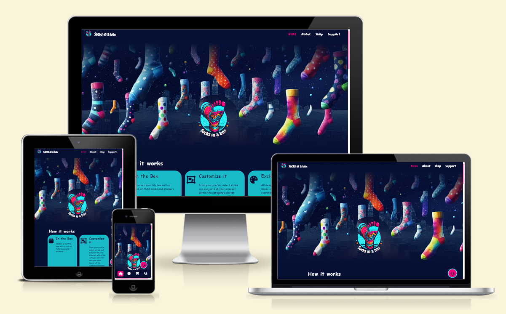
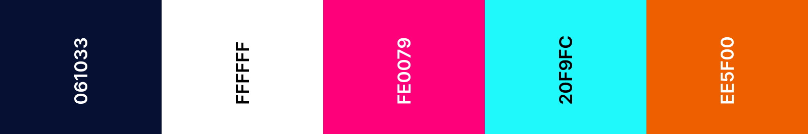
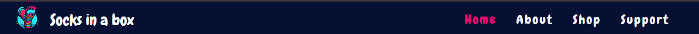
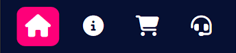
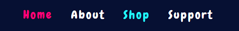
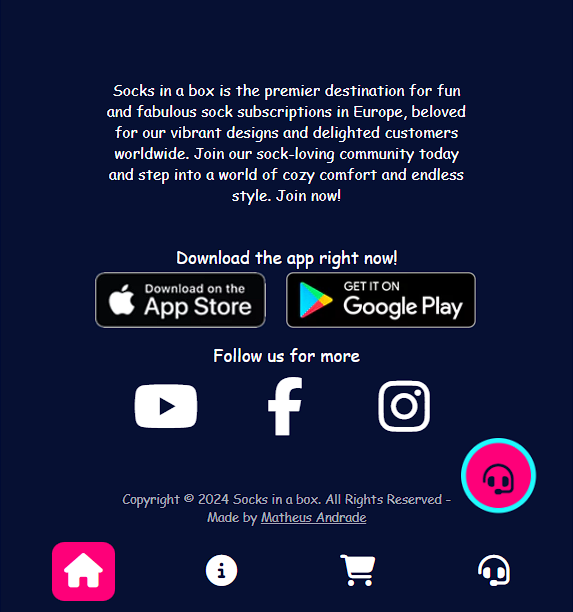
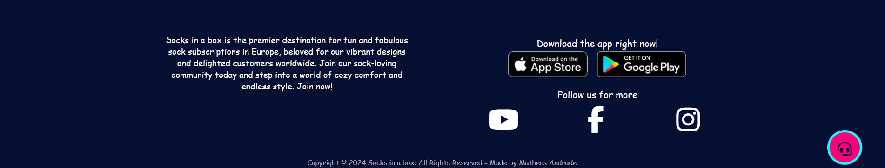

# Socks in a Box

[Live project can be viewed here](https://catapam.github.io/socks-in-a-box/)

A site of a subscription club for fun socks delivered monthly. The idea is to deliver a landing page with full understanding of how the business works, how the business was born and why, page to sign up for the available plans and support.

# Table of Contents

* [User Experience](#user-experience)
    * [User Experience](#user-stories)
* [Design](#design)
    * [Color scheme](#color-scheme)
    * [Typography](#typography)
    * [Images](#images)
    * [Wireframes](#wireframes)
* [Features](#features)
    * [Existing features](#existing-features)
        * [Main page tempalte](#main-page-template)
            * [Header](#header)
            * [Main menu](#main-menu)
            * [Footer](#footer)
        * [Home page](#home-page)
    * [Future features](#future-features)
* [Technology used](#technology-used)
    * [Language](#language)
    * [Frameworks, Libraries & Programs](#frameworks-libraries--programs)
* [Deployment](#deployment)
* [Testing](#testing)
    * [Home](#home)
    * [About](#about)
    * [Shop](#shop)
    * [Support](#support)
    * [Thank you](#thank-you)
    * [Purchased](#purchased)
    * [404](#404)
* [Credits](#credits)
    * [Code](#code)
    * [Content](#content)
    * [README](#readme)
* [Acknowledgements](#acknowledgements)

# User Experience

The goal on this was to be fun and match the tone the brand and business concept states.
 
 
In order to achieve that, psychodelic colors were choosen as Palette and images that bring those same colors and sentiment were developed.
 
 
The top menu is alive and gives feedback to the user when hoovered and/or clicked, showing where the user is at that exact moment by setting a different color to the page name on the menu. That menu is only visible on bigger screens, while it's substituted by a App style menu at the bottom of the screen, which also mark the page by changin icon colors. Both menus are always fixed, so user don't need to scroll to navigate to other pages.
 
 
The main content of home page also has some hover effects to bring the FUN sentiment set as main tone of the site, that same concept is brought to the Shop page, while About is more sober and focused in storytelling, and Support page focus in bringing the fun sentiment through colors and a easy going FAQ section.
 
 
All hero images have 3 different sizes, and media queries swapt between them to offer a better performance on all devices.
 
 
A quick support button is always fixed at the bottom-right corner of all pages (except support page), so user don't need to navigate to support page if they need to contact the team quickly.
 
 
Support form is added to the body of Support page, after the FAQ section, while the quick support button is removed. That is intentional to make the users check FAQ section before submitting a form on that page.
 
 
Submitting a support forms, will redirect the user to a 'Thank you' page, which will be visible for 7 seconds before automatically redirecting the user back to home page.
 
 
Shop page has a toggle where user can switch between annual and monthly plan, toggling it gives the user feedback changing the price the billing cycle and removing the offer if 'Annual' is selected.
 
 
Clicking on the subscribe buttons from shop page, open a pop-up, with blurred background, to keep the user focused on that form while creating their account. Once the form is submitted, the user is redirected to a 'Welcome' page, with instructions on how to access the account and download the app, which will be visible for 7 seconds before automatically redirecting the user back to home page. 
 
 
Accessing non-existent pages will throw a custom 404 error page which allows navigation using the default menus, or will automatically redirect the user back to home page after 7 seconds.

## User stories

* First Time User
    * As a first time user, we want to understand the product, navigate easily and intuitivelly through the site;
    * As a first time user, we want a first contact with the community checking testimonials and gallery;
    * As a first time user, we want to have access to the app and see how it works before subscribing to the service;
    * As a first time user, we want to have easy access to the shop page, account creation and support.
* Returning User
    * As a returning user, we want to have easy buttons to download the app
    * As a returning user, we want to reach to support without having to navigate to any other pages

# Design

## Color scheme

* The color scheme was created based on initial image concepts generated by [Dall-e AI by ChatGPT](https://openai.com/dall-e-3);
* My script to the AI was to generate psychodelic images of socks rainning above a city, something similar to the current hero image on the site. The colors used were shades of Pink, dark blue, cian, yellow and orange.
* The final choice was made in [Canva](https://www.canva.com/) during the logo creation and later added to [Coolors](https://coolors.co/) to create the palette:

## Typography

* The fonts were choosen on [Google fonts](https://fonts.google.com/), thinking of keeping the Fun tone set for the whole site.
* The font used for logo, menus and some headings is [Chewy](https://fonts.google.com/specimen/Chewy?query=chewy), which was imported from Google Fonts too. The secondary font choosen, used for most paragraph elements, lists and others, was Comic Sans MS, which is a default font and did not need importing.
* Fallback font selected was sans-serif

## Images

* The mockup app images were created using [Canva](https://www.canva.com/);
* All other images were created with [Dall-e AI by ChatGPT](https://openai.com/dall-e-3);
* The hero images were post-editted in Canva, adding effects, background and shades;
* The site's logo was created on [Microsoft Copilot](https://copilot.microsoft.com/), and editted in Canva adding the text, and removing unwanted elements.

## Wireframes
--- Needed?

# Features
## Existing features
### Main page template
#### Header
* The header has the logo at the very left corner, followed by the brand name;
* At the very right corner the Main menu is visible;
* The header is only visible in screens bigger than 576px;
* All header elements show animation when hoovered above;
* The brand name redirects back to home page, a wide concept used in most sites, which brings some familiar behaviors to the end user.
 

#### Main menu
* The main menu varies in location and behavior depending on width of the screen.
* The default menu is set for mobile versions on screens up to 576px wide, that menu is located at the very bottom of the screen and always fixed to that location. Bringing the same feeling of the mockup app images. Intuitive icons were used to translate the destination page.
 

* Menu for bigger screens is set on the media queries, for screens bigger than 576px wide. This menu will change to color #20F9FC 
 and present a lateral shake animation when hoovered above:
 

* Both menus show the same pages in the a same order for a better User experience and when pages are active they mark the page by changing the menu color to #fe0079.

#### Footer
* On mobile version the menu is moved to the footer and changes from text to icons
* The footer presents a breaf description of what Socks in a box is, links to download the apps: iOS and Android versions, the links for social medias and a Copyright watermark at the very bottom:
 

 

### Home page

## Future features
* Membership login backend to access and manage the account same way as the mockup app advertises. 

# Technology used
## Language
* HTML
* CSS
* JavaScript, minimal usage

## Frameworks, Libraries & Programs
* [Balsamiq](https://balsamiq.com/wireframes/) was used to create the wireframes to plan out the website.
* [GoogleFonts](https://fonts.google.com/) were used to import the font
* [FontAwesome](https://fontawesome.com/) was used to pick the social icons
* [Coolors](https://coolors.co/) was used to to pick the color palette
* [Git](https://git-scm.com/) was used for version control
* [Gitpod](https://gitpod.io/) was used to write the code
* [GitHub](https://github.com/) was used to deploy the site code
* [AmIResponsive](https://ui.dev/amiresponsive) was used to create the cross device responsivity images
* [Microsoft Copilot](https://copilot.microsoft.com/), [Canva](https://www.canva.com/) and [Dall-e AI by ChatGPT](https://openai.com/dall-e-3) were used for images creation
* [ChatGPT](https://chat.openai.com/) was used for text reviews and copywritting

# Deployment

GitHub pages was used to deploy this site:

1. Login (or signup) to Github.
2. Go to the repo for the project, [catapam/socks-in-a-box](https://github.com/catapam/socks-in-a-box).
3. Click the settings button.
4. Select pages on the left navigation menu.
5. From the source dropdown select main branch and click save next to it.
6. The site has been deployed on clicking save, this can take a few moments to generate the live link at the top of the settings page.

# Testing
- Testing was mainly made using Google Chrome Developer Tools, including the mobile and responsive views.
- Lighthouse tab of developer tools was used to score the site regarding Performance, Acessibility and SEO.
- Forms were tested by posting data to Code Institute's formdump at first and then updated to redirect to the thankyou and purchased pages.
- The site was tested on other devices using Edge, Firefox and Safari. When testing on desktops with OS: Mac iOS and Windows 11. And on mobile OS: Android and iOS.

The W3C Markup Validator and W3C CSS Validator Services were used to validate the project to ensure there were no syntax errors in the project.
-   [W3C CSS Validator](https://jigsaw.w3.org/css-validator/validator?uri=https%3A%2F%2Fcatapam.github.io%2Fsocks-in-a-box%2Findex.html&profile=css3svg&usermedium=all&warning=1&vextwarning=&lang=en-US)

## Home
* [W3C Markup Validator](https://validator.w3.org/nu/?doc=https%3A%2F%2Fcatapam.github.io%2Fsocks-in-a-box%2Findex.html)
* [Wave Accessiblity result](https://wave.webaim.org/report#/https://catapam.github.io/socks-in-a-box/index.html)
* Lighthouse result for mobile version:

* Lighthouse result for desktop version:

## About
* [W3C Markup Validator](https://validator.w3.org/nu/?doc=https%3A%2F%2Fcatapam.github.io%2Fsocks-in-a-box%2Fabout.html)
* [Wave Accessiblity result](https://wave.webaim.org/report#/https://catapam.github.io/socks-in-a-box/about.html)
* Lighthouse result for mobile version:

* Lighthouse result for desktop version:

## Shop
* [W3C Markup Validator](https://validator.w3.org/nu/?doc=https%3A%2F%2Fcatapam.github.io%2Fsocks-in-a-box%2Fshop.html)
* [Wave Accessiblity result](https://wave.webaim.org/report#/https://catapam.github.io/socks-in-a-box/shop.html)
* Lighthouse result for mobile version:

* Lighthouse result for desktop version:

## Support
* [W3C Markup Validator](https://validator.w3.org/nu/?doc=https%3A%2F%2Fcatapam.github.io%2Fsocks-in-a-box%2Fsupport.html) 
* [Wave Accessiblity result](https://wave.webaim.org/report#/https://catapam.github.io/socks-in-a-box/support.html)
* Lighthouse result for mobile version:

* Lighthouse result for desktop version:

## Thank you
* [W3C Markup Validator](https://validator.w3.org/nu/?doc=https%3A%2F%2Fcatapam.github.io%2Fsocks-in-a-box%2Fthankyou.html) 
* [Wave Accessiblity result](https://wave.webaim.org/report#/https://catapam.github.io/socks-in-a-box/thankyou.html)
* Lighthouse result for mobile version:

* Lighthouse result for desktop version:

## Purchased
* [W3C Markup Validator](https://validator.w3.org/nu/?doc=https%3A%2F%2Fcatapam.github.io%2Fsocks-in-a-box%2Fpurchased.html) 
* [Wave Accessiblity result](https://wave.webaim.org/report#/https://catapam.github.io/socks-in-a-box/purchased.html)
* Lighthouse result for mobile version:

* Lighthouse result for desktop version:

## 404
* [W3C Markup Validator](https://validator.w3.org/nu/?doc=https%3A%2F%2Fcatapam.github.io%2Fsocks-in-a-box%2F404.html) 
* [Wave Accessiblity result](https://wave.webaim.org/report#/https://catapam.github.io/socks-in-a-box/404.html)
* Lighthouse result for mobile version:

* Lighthouse result for desktop version:

# Credits
## Code
* [Mozilla CSS reference](https://developer.mozilla.org/en-US/docs/Web/CSS/Reference) was a big player on development of the site styles, animations and behavior. Where examples were used as reference for initial coding and adaptations made according to the documentation the site provides.

## Content
* [ChatGPT](https://chat.openai.com/) was used for text reviews and copywritting0

## README
* (Mario Gusman - Bookdrops - README)[https://github.com/mariogusman/bookdrops/blob/main/README.md] was used as reference for the README structure
* (Saziosu - Harmony Pilates - README)[https://github.com/saziosu/harmony-pilates/blob/main/README.md] was used as reference for the README structure

# Acknowledgements
- Gareth Mc Girr my mentor, for all the help and advice throughout the project
- Code Institute for all the training and guidance