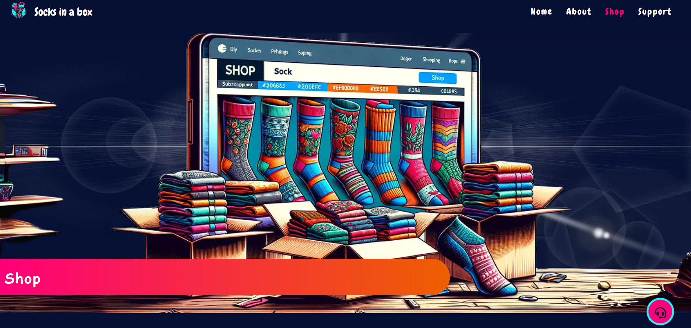

# Socks in a Box

[Live project can be viewed here](https://catapam.github.io/socks-in-a-box/)

A site of a subscription club for fun socks delivered monthly. The idea is to deliver a landing page with full understanding of how the business works, how the business was born and why, page to sign up for the available plans and support.

# Table of Contents

* [User Experience](#user-experience)
    * [User Experience](#user-stories)
* [Design](#design)
    * [Color scheme](#color-scheme)
    * [Typography](#typography)
    * [Images](#images)
    * [Wireframes](#wireframes)
* [Features](#features)
    * [Existing features](#existing-features)
        * [Main page tempalte](#main-page-template)
            * [Header](#header)
            * [Main menu](#main-menu)
            * [Footer](#footer)
            * [Quick support button](#quick-support-button)
        * [Home page](#home-page)
            * [Landing page](#landing-page)
            * [Features section](#features-section)
            * [Account management](#account-management)
            * [Testimonials](#testimonials)
            * [Hall of fame](#hall-of-fame)
        * [About](#about-1)
            * [Hero journey](#hero-journey)
            * [The hero story](#the-hero-story)
            * [Why should I stay here?](#why-should-i-stay-here)
            * [Call for action](#call-for-action)
    * [Future features](#future-features)
* [Technology used](#technology-used)
    * [Language](#language)
    * [Frameworks, Libraries & Programs](#frameworks-libraries--programs)
* [Deployment](#deployment)
* [Testing](#testing)
    * [Home](#home)
    * [About](#about)
    * [Shop](#shop)
    * [Support](#support)
    * [Thank you](#thank-you)
    * [Purchased](#purchased)
    * [404](#404)
    * [Future improvements](#future-improvements)
* [Credits](#credits)
    * [Code](#code)
    * [Content](#content)
    * [README](#readme)
* [Acknowledgements](#acknowledgements)

# User Experience

The goal on this was to be fun and match the tone the brand and business concept states.
 
 
In order to achieve that, psychodelic colors were choosen as Palette and images that bring those same colors and sentiment were developed.
 
 
The top menu is alive and gives feedback to the user when hoovered and/or clicked, showing where the user is at that exact moment by setting a different color to the page name on the menu. That menu is only visible on bigger screens, while it's substituted by a App style menu at the bottom of the screen, which also mark the page by changin icon colors. Both menus are always fixed, so user don't need to scroll to navigate to other pages.
 
 
The main content of home page also has some hover effects to bring the FUN sentiment set as main tone of the site, that same concept is brought to the Shop page, while About is more sober and focused in storytelling, and Support page focus in bringing the fun sentiment through colors and a easy going FAQ section.
 
 
All hero images have 3 different sizes, and media queries swapt between them to offer a better performance on all devices.
 
 
A quick support button is always fixed at the bottom-right corner of all pages (except support page), so user don't need to navigate to support page if they need to contact the team quickly.
 
 
Support form is added to the body of Support page, after the FAQ section, while the quick support button is removed. That is intentional to make the users check FAQ section before submitting a form on that page.
 
 
Submitting a support forms, will redirect the user to a 'Thank you' page, which will be visible for 7 seconds before automatically redirecting the user back to home page.
 
 
Shop page has a toggle where user can switch between annual and monthly plan, toggling it gives the user feedback changing the price the billing cycle and removing the offer if 'Annual' is selected.
 
 
Clicking on the subscribe buttons from shop page, open a pop-up, with blurred background, to keep the user focused on that form while creating their account. Once the form is submitted, the user is redirected to a 'Welcome' page, with instructions on how to access the account and download the app, which will be visible for 7 seconds before automatically redirecting the user back to home page. 
 
 
Accessing non-existent pages will throw a custom 404 error page which allows navigation using the default menus, or will automatically redirect the user back to home page after 7 seconds.

## User stories

* First Time User
    * As a first time user, we want to understand the product, navigate easily and intuitivelly through the site;
    * As a first time user, we want a first contact with the community checking testimonials and gallery;
    * As a first time user, we want to have access to the app and see how it works before subscribing to the service;
    * As a first time user, we want to have easy access to the shop page, account creation and support.
* Returning User
    * As a returning user, we want to have easy buttons to download the app
    * As a returning user, we want to reach to support without having to navigate to any other pages

# Design

## Color scheme

* The color scheme was created based on initial image concepts generated by [Dall-e AI by ChatGPT](https://openai.com/dall-e-3);
* My script to the AI was to generate psychodelic images of socks rainning above a city, something similar to the current hero image on the site. The colors used were shades of Pink, dark blue, cian, yellow and orange.
* The final choice was made in [Canva](https://www.canva.com/) during the logo creation and later added to [Coolors](https://coolors.co/) to create the palette:

## Typography

* The fonts were choosen on [Google fonts](https://fonts.google.com/), thinking of keeping the Fun tone set for the whole site.
* The font used for logo, menus and some headings is [Chewy](https://fonts.google.com/specimen/Chewy?query=chewy), which was imported from Google Fonts too. The secondary font choosen, used for most paragraph elements, lists and others, was Comic Sans MS, which is a default font and did not need importing.
* Fallback font selected was sans-serif

## Images

* The mockup app images were created using [Canva](https://www.canva.com/);
* All other images were created with [Dall-e AI by ChatGPT](https://openai.com/dall-e-3);
* The hero images were post-editted in Canva, adding effects, background and shades;
* The site's logo was created on [Microsoft Copilot](https://copilot.microsoft.com/), and editted in Canva adding the text, and removing unwanted elements.

## Wireframes
--- Needed?

# Features
## Existing features
### Main page template
#### Header
* The header has the logo at the very left corner, followed by the brand name;
* At the very right corner the Main menu is visible;
* The header is only visible in screens bigger than 576px;
* All header elements show animation when hoovered above;
* The brand name redirects back to home page, a wide concept used in most sites, which brings some familiar behaviors to the end user.
 

#### Main menu
* The main menu varies in location and behavior depending on width of the screen.
* The default menu is set for mobile versions on screens up to 576px wide, that menu is located at the very bottom of the screen and always fixed to that location. Bringing the same feeling of the mockup app images. Intuitive icons were used to translate the destination page.
 

* Menu for bigger screens is set on the media queries, for screens bigger than 576px wide. This menu will change to color #20F9FC 
 and present a lateral shake animation when hoovered above:
 

* Both menus show the same pages in the a same order for a better User experience and when pages are active they mark the page by changing the menu color to #fe0079.

#### Footer
* On mobile version the menu is moved to the footer and changes from text to icons
* The footer presents a breaf description of what Socks in a box is, links to download the apps: iOS and Android versions, the links for social medias and a Copyright watermark at the very bottom:
 

 

#### Quick support button
* A button fixed to all pages (except support page) is shown at the bottom-right corner, this button has an animatioon that pulses it twice every now and again, calling the attention to user to use the button if necesary. That can be used in the future as a sale trigger.
 

* When clicked the button opens a pop-up of the support form:
 

### Home page
## Landing page
* The hero image shows a rain of colorfull fun socks with variations of the color scheme of the site, the rain drops over a city at night, bringing the feeling of a rainy-night confort.
* At the center of the hero image there is an iception of the brand logo.
 

 

## Features section
* The features section brings 6 cards with the main features of the product.
 

 

* On mobile versions the features get reorganized to fit the width of the screen, varying between 1 or 2 columns depending on the room available
  

 

 

* When hoovered over on desktop version or clicked on mobile versions, the card grows and shine in pink to gain some focus. If the screen has enough room for 3 columns, the lateral cards will incline and distort a little to bring some depth to the page. Check the top-right card on the example:
  

 

## Account management
* The account management section is a call for action, the main focus is to make the user download the app and start their test account, that may be used as a sales lead. For this reason the main focus of this section is on the Heading call to join the service and the download buttons. That can be well seen on the mobile version:
  

 

* The full content of this section can be seen by scrolling down on mobile versions, but it's visible at first sight on desktop. The full content shows how the app layout is and gives some idea of what some sections of the app offer:
  

 

## Testimonials
* The focus of the home page is create engaging customer ready to purchase the product, so the next section after showing the app and how to download it is focused in bringing feedback of current customers. That is achieve with real testimonials of satisfied customers, that bring the use cases they had for the product.
* The section is divided by cards, where each customer has it's own card with a picture, name and testimonial.
  

 

* When viewed full screen the section will fit 8 testimonials at max divided in 2 rows of 4, but on mobile version all the fun is back at play with a scrollable section, adding some lightning at the very start and end of the screen to show clearly to the user that this section can be scrollable vertically with a simple touch of the screen. The lightning is a well used concept in the industry, with many popular apps and sites using it, so the behavior is familiar to most users.
  

 

## Hall of fame
* This site is all about engaging and selling. So the last section specific to home page is focused to bring posts on social media from the community. Showing all the happiness on good pictures selected by the own user to post on their profiles. This can be reinforced with posting campaigns, sales leads and community behavior.
  

 

# About
## Hero journey
* This page is not very animated with effects, but that is intentional. This page is focused in storytelling, the user that came here is already half-convinced they want to be part of the community. So this is the first chapter of a book where the user will decide to keep reading or pass it ahead. So in order to keep to focus, the page is mostly static, with a great choice of words on each section of the page.
* About us page starts with a hero image, this image is brand in a simple terms, the focus is mainly in socks, colorful and funny socks. An element of a box as central to the socks explosion stamps the whole brand in simple terms so anyone can understand it easily.
* Different from home page, above the hero image there is an element in gradient using colors of the brand which makes it clear where the user is, calling out loud: About Us.
  

 

* The page continues with the hero journey, a brief explanation in 2 short paragraphs of what the company dues, the values and who is the target public. All of that with a beatifull storytelling that keeps the user caught in to learn more about us. The tone set is informal and friendly, bringing the new user into the community with a warm hug.
> Welcome to Socks in a Box, your ultimate destination for high-quality socks delivered right to your doorstep every month! We believe that great socks shouldn't be hard to find, which is why we've made it our mission to curate the finest selection of socks and deliver them directly to you, hassle-free.
 

> At Socks in a Box, we're passionate about more than just keeping your feet cozy. We're dedicated to bringing joy and style to your everyday life, one pair of socks at a time. Whether you're a sock enthusiast looking to expand your collection or someone simply in need of fresh, comfortable socks, we've got you covered.
 

## The hero story
* The section entitled 'Our story' for the user, is a brief story of what was the motivation to start the business. Why the community matter so much for the brand, more about values (confort, convenience, quality...). Each word is there for a reason, revolutionize...
> Our journey began with a simple idea: to revolutionize the way people think about socks. Tired of bland, boring options at local stores, we set out to create a subscription service that offered convenience, quality, and a touch of personality. Thus, Socks in a Box was born.
 

> Since our humble beginnings, we've grown into a thriving community of sock lovers who appreciate the convenience and excitement of receiving a curated selection of socks every month. With our commitment to exceptional customer service and top-notch products, we continue to redefine the sock-shopping experience for our members.

## Why should I stay here?
* At this section the focus is in selling the product, already preparing for the next section. The topics focus in confirming to the user why the hate going to shop boring socks, and that the alternative (Socks in a box) is so much better
>Curated Selection: Each month, our team handpicks a unique assortment of socks from the best brands and designers around the world, ensuring you always receive top-quality products that reflect the latest trends and styles.
 

>Convenience: Say goodbye to tedious trips to the store. With Socks in a Box, you can effortlessly build your sock collection from the comfort of your home. Simply choose your subscription plan, sit back, and await your monthly delivery.
 

>Quality Guaranteed: We take pride in the quality of our socks. Made from premium materials and crafted with care, our socks are designed to provide superior comfort, durability, and style, so you can step out with confidence every day.
 

>Flexible Subscriptions: Whether you're interested in a month-to-month plan or prefer to prepay for several months at a time, we offer flexible subscription options to suit your needs and budget. Plus, you can easily manage your subscription online, making it simple to pause, skip, or cancel anytime.
 

>Surprise and Delight: Part of the fun of being a member of Socks in a Box is the element of surprise. Each month, you'll receive a carefully curated selection of socks tailored to your preferences, ensuring that every unboxing is a delightful experience.

## Call for action
* After convincing now the user just needs a push, so this section focus on inviting the new user to the community. With download links right below this section on the deafult footer:
  

 

# Shop
## Hero image
* The hero image is a setup, translating the simplicity of online shopping. Also bringing elements of the brand socks, boxes and the brand colors in a fun way.
 

 

* Different from home page, above the hero image there is an element in gradient using colors of the brand which makes it clear where the user is, calling out loud: About Us.
## Shop
* This page is straight to the point, the user that came here is ready to buy, so the only element on the page body is a section of the plans offered.
* Each plan shows it's price and features.
* The paid plans also bring a toggle element and an offer banner, pusing the user towards selecting Annual plan and get commited to the service for a longer period due to a discount on that option.
* The toggle button when clicked will set the plan to Annual, change the pricing detail by applying the discount and removing the discount flashing banner. See the example of different options selected for Starter and Pro plans:
 

 

## Subscribe
* The subscribe buttons on the page will open a pop-up of a form, the focus of the page on the background is removed with a blur effect, keeping the focus on the form fields. This is a well used strategy in the industry, the focus on using it here is to help the new user in setting correct details to their account, reducing potencial account recovery contacts to the support.
 

 

## Future features
* Membership login backend to access and manage the account same way as the mockup app advertises.
* Quick support button works as a sale trigger, offering quick contact with sales team.

# Technology used
## Language
* HTML
* CSS
* JavaScript, minimal usage

## Frameworks, Libraries & Programs
* [Balsamiq](https://balsamiq.com/wireframes/) was used to create the wireframes to plan out the website.
* [GoogleFonts](https://fonts.google.com/) were used to import the font
* [FontAwesome](https://fontawesome.com/) was used to pick the social icons
* [Coolors](https://coolors.co/) was used to to pick the color palette
* [Git](https://git-scm.com/) was used for version control
* [Gitpod](https://gitpod.io/) was used to write the code
* [GitHub](https://github.com/) was used to deploy the site code
* [AmIResponsive](https://ui.dev/amiresponsive) was used to create the cross device responsivity images
* [Microsoft Copilot](https://copilot.microsoft.com/), [Canva](https://www.canva.com/) and [Dall-e AI by ChatGPT](https://openai.com/dall-e-3) were used for images creation
* [ChatGPT](https://chat.openai.com/) was used for text reviews and copywritting

# Deployment

GitHub pages was used to deploy this site:

1. Login (or signup) to Github.
2. Go to the repo for the project, [catapam/socks-in-a-box](https://github.com/catapam/socks-in-a-box).
3. Click the settings button.
4. Select pages on the left navigation menu.
5. From the source dropdown select main branch and click save next to it.
6. The site has been deployed on clicking save, this can take a few moments to generate the live link at the top of the settings page.

# Testing
- Testing was mainly made using Google Chrome Developer Tools, including the mobile and responsive views.
- Lighthouse tab of developer tools was used to score the site regarding Performance, Acessibility and SEO.
- Forms were tested by posting data to Code Institute's formdump at first and then updated to redirect to the thankyou and purchased pages.
- The site was tested on other devices using Edge, Firefox and Safari. When testing on desktops with OS: Mac iOS and Windows 11. And on mobile OS: Android and iOS.

The W3C Markup Validator and W3C CSS Validator Services were used to validate the project to ensure there were no syntax errors in the project.
-   [W3C CSS Validator](https://jigsaw.w3.org/css-validator/validator?uri=https%3A%2F%2Fcatapam.github.io%2Fsocks-in-a-box%2Findex.html&profile=css3svg&usermedium=all&warning=1&vextwarning=&lang=en-US)

### Home
* [W3C Markup Validator](https://validator.w3.org/nu/?doc=https%3A%2F%2Fcatapam.github.io%2Fsocks-in-a-box%2Findex.html)
* [Wave Accessiblity result](https://wave.webaim.org/report#/https://catapam.github.io/socks-in-a-box/index.html)
* Lighthouse result for mobile version:

* Lighthouse result for desktop version:

### About
* [W3C Markup Validator](https://validator.w3.org/nu/?doc=https%3A%2F%2Fcatapam.github.io%2Fsocks-in-a-box%2Fabout.html)
* [Wave Accessiblity result](https://wave.webaim.org/report#/https://catapam.github.io/socks-in-a-box/about.html)
* Lighthouse result for mobile version:

* Lighthouse result for desktop version:

### Shop
* [W3C Markup Validator](https://validator.w3.org/nu/?doc=https%3A%2F%2Fcatapam.github.io%2Fsocks-in-a-box%2Fshop.html)
* [Wave Accessiblity result](https://wave.webaim.org/report#/https://catapam.github.io/socks-in-a-box/shop.html)
* Lighthouse result for mobile version:

* Lighthouse result for desktop version:

### Support
* [W3C Markup Validator](https://validator.w3.org/nu/?doc=https%3A%2F%2Fcatapam.github.io%2Fsocks-in-a-box%2Fsupport.html) 
* [Wave Accessiblity result](https://wave.webaim.org/report#/https://catapam.github.io/socks-in-a-box/support.html)
* Lighthouse result for mobile version:

* Lighthouse result for desktop version:

### Thank you
* [W3C Markup Validator](https://validator.w3.org/nu/?doc=https%3A%2F%2Fcatapam.github.io%2Fsocks-in-a-box%2Fthankyou.html) 
* [Wave Accessiblity result](https://wave.webaim.org/report#/https://catapam.github.io/socks-in-a-box/thankyou.html)
* Lighthouse result for mobile version:

* Lighthouse result for desktop version:

### Purchased
* [W3C Markup Validator](https://validator.w3.org/nu/?doc=https%3A%2F%2Fcatapam.github.io%2Fsocks-in-a-box%2Fpurchased.html) 
* [Wave Accessiblity result](https://wave.webaim.org/report#/https://catapam.github.io/socks-in-a-box/purchased.html)
* Lighthouse result for mobile version:

* Lighthouse result for desktop version:

### 404
* [W3C Markup Validator](https://validator.w3.org/nu/?doc=https%3A%2F%2Fcatapam.github.io%2Fsocks-in-a-box%2F404.html) 
* [Wave Accessiblity result](https://wave.webaim.org/report#/https://catapam.github.io/socks-in-a-box/404.html)
* Lighthouse result for mobile version:

* Lighthouse result for desktop version:

## Future improvements
* Work on the hero images to improve performance scores on all pages containing it. As the low score shown on test are all linked to LCP on those images:
 

# Credits
## Code
* [Mozilla CSS reference](https://developer.mozilla.org/en-US/docs/Web/CSS/Reference) was a big player on development of the site styles, animations and behavior. Where examples were used as reference for initial coding and adaptations made according to the documentation the site provides.

## Content
* [ChatGPT](https://chat.openai.com/) was used for text reviews and copywritting0

## README
* [Mario Gusman - Bookdrops - README](https://github.com/mariogusman/bookdrops/blob/main/README.md) was used as reference for the README structure
* [Saziosu - Harmony Pilates - README](https://github.com/saziosu/harmony-pilates/blob/main/README.md) was used as reference for the README structure

# Acknowledgements
- Gareth Mc Girr my mentor, for all the help and advice throughout the project
- Code Institute for all the training and guidance